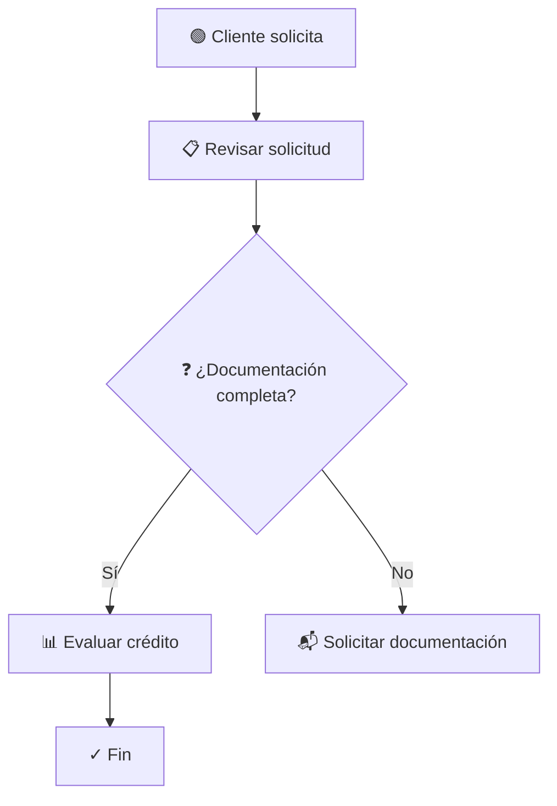

[README.md](https://github.com/user-attachments/files/27418495/README.md)
# BPMN Process Generator Skill

A Claude skill that automatically generates BPMN 2.0 compliant process diagrams from documentation, meeting transcriptions, and structured data.

## Quick Start

### Installation

This skill is ready to use with Claude. Simply ensure you have Python 3.8+ available (no external dependencies required).

### Basic Usage

```python
from bpmn_processor_complete import BPMNProcessor

# Create processor
processor = BPMNProcessor(language="es")

# Your process description
process_doc = """
El cliente solicita un producto.
El vendedor revisa el stock.
Si hay stock, prepara la factura.
Si no, avisa al cliente.
"""

# Generate BPMN
result = processor.process(
    input_text=process_doc,
    process_name="Gestión de Pedidos",
    swimlane_by="role",
    output_formats=["bpmn_xml", "svg"]
)

# Use results
if result["success"]:
    print(result["data"]["metadata"])
    # Save BPMN XML
    with open("process.bpmn", "w") as f:
        f.write(result["data"]["bpmn_xml"])
```

### Example Skill Use Cases

#### 1. Generate from Documentation
User: "Create a BPMN diagram for my loan approval process from this description..."

```python
processor.process(user_description, process_name="Loan Approval")
```

#### 2. Process Meeting Transcript
User: "I have a Zoom transcript of our team discussing the new onboarding process. Can you create a BPMN diagram?"

```python
processor.process(transcript, process_name="Onboarding (from meeting)")
```

#### 3. Validate Existing BPMN
User: "Can you validate this BPMN file and tell me if it's compliant with BPMN 2.0?"

```python
from bpmn_validator_tests import BPMNValidator
validator = BPMNValidator()
validation = validator.validate_xml(bpmn_content)
```

#### 4. Multiple Output Formats
User: "Generate BPMN for our service request process in multiple formats for Bizagi and documentation."

```python
processor.process(
    input_text=doc,
    output_formats=["bpmn_xml", "mermaid", "svg", "json"]
)
```

## Features

- **Automatic Extraction**: Identifies actors, tasks, decisions, and flows from text
- **BPMN 2.0 Valid**: Generates 100% OASIS-compliant XML
- **Multiple Inputs**: Supports documentation, transcriptions, and JSON
- **Multiple Outputs**: BPMN XML, JSON, SVG, and Mermaid
- **Validation**: Comprehensive BPMN 2.0 compliance checking
- **Visualization**: Automatic layout with swimlanes and element positioning
- **Language Support**: Spanish, English, Portuguese, French
- **No Dependencies**: Pure Python 3.8+ standard library

## Available Files

- **SKILL.md** - Skill specification and capabilities
- **bpmn_processor_complete.py** - Core processor module (1,192 lines)
- **bpmn_validator_tests.py** - Validation and test suite (393 lines)
- **demo.py** - Interactive demonstration (459 lines)
- **examples/** - Sample process descriptions
- **LICENSE.txt** - MIT License

## Running the Demo

See live demonstrations of all features:

```bash
python3 demo.py
```

This will:
1. Show 5 complete examples
2. Generate BPMN XML, SVG, and Mermaid output
3. Demonstrate validation
4. Show import instructions for Bizagi/Draw.io
5. Display usage statistics

## Language Support

- **es** (Español) - Default, fully optimized
- **en** (English) - Supported
- **pt** (Português) - Supported
- **fr** (Français) - Supported

## Output Examples

### From This Input
```
El cliente solicita un préstamo.
El gerente revisa la solicitud.
Si la documentación está completa, evalúa el crédito.
Si no, solicita documentación adicional.
Se aprueba o rechaza.
Se notifica al cliente.
```

### You Get This BPMN XML
```xml
<?xml version="1.0" encoding="UTF-8"?>
<bpmn2:definitions xmlns:bpmn2="http://www.omg.org/spec/BPMN/20100524/MODEL">
  <bpmn2:collaboration id="Collaboration_1">
    <bpmn2:participant id="Participant_lane_actor_0" name="Cliente"/>
    <bpmn2:participant id="Participant_lane_actor_1" name="Gerente"/>
  </bpmn2:collaboration>
  
  <bpmn2:process id="Process_1" name="Loan Process">
    <!-- Complete BPMN 2.0 XML with all elements -->
    <bpmn2:startEvent id="event_start" name="Cliente solicita"/>
    <bpmn2:task id="task_0" name="Revisar solicitud"/>
    <bpmn2:exclusiveGateway id="decision_0" name="¿Documentación completa?"/>
    <!-- ... más elementos -->
  </bpmn2:process>
  
  <bpmn2:BPMNDiagram id="BPMNDiagram_1">
    <!-- Diagram Interchange for visualization -->
  </bpmn2:BPMNDiagram>
</bpmn2:definitions>
```

### Plus SVG Visualization
- Swimlanes for Cliente and Gerente
- Color-coded elements (green events, blue tasks, gold decisions)
- Auto-positioned with proper spacing
- Directional flow arrows with conditions

### Plus Mermaid Syntax


## Integration with Tools

### Bizagi Studio
1. File → Import → BPMN 2.0 (.bpmn)
2. Select generated .bpmn file
3. Process ready for editing and execution

### Camunda Modeler
1. Open generated .bpmn file
2. Edit and add Camunda extensions
3. Deploy to Camunda engine

### Draw.io
1. File → Import from → Device
2. Select .bpmn or .svg file
3. Edit in Draw.io interface

### GitHub/Documentation
1. Use generated Mermaid syntax
2. Paste in README.md
3. GitHub automatically renders diagram

## API Reference

### BPMNProcessor

```python
processor = BPMNProcessor(language="es")

result = processor.process(
    input_text: str,              # Process description
    process_name: str = "Process",   # Custom process name
    swimlane_by: str = "role",    # "role", "department", or "none"
    output_formats: list = ["bpmn_xml", "json", "svg"],
    language: str = "es"          # Supported: es, en, pt, fr
)

# Result structure
{
    "success": True,
    "data": {
        "bpmn_xml": "<bpmn2:definitions...>",  # BPMN 2.0 XML
        "json": {...},                          # Structured data
        "svg": "<svg...>",                      # Diagram visualization
        "mermaid": "graph TD...",              # Mermaid syntax
        "metadata": {
            "process_name": "Process Name",
            "elements_count": 7,
            "flows_count": 8,
            "lanes_count": 2,
            "actors": ["Actor1", "Actor2"],
            "tasks_count": 3,
            "decisions_count": 1
        }
    },
    "errors": []
}
```

### BPMNValidator

```python
from bpmn_validator_tests import BPMNValidator

validator = BPMNValidator()
validation = validator.validate_xml(bpmn_xml_string)

# Result structure
{
    "valid": True,
    "errors": [],
    "warnings": [],
    "info": ["✓ XML well formed", ...],
    "summary": {
        "total_errors": 0,
        "total_warnings": 0,
        "total_info": 8
    }
}
```

## Examples in the Skill

See the `examples/` directory for:
- **simple_order_process.txt** - Basic order workflow
- **credit_request_process.txt** - Complex process from meeting transcript
- **employee_onboarding.json** - JSON structured process

## Supported BPMN Elements

- ✅ Start Event (`startEvent`)
- ✅ End Event (`endEvent`)
- ✅ Task (`task`)
- ✅ Exclusive Gateway (`exclusiveGateway`)
- ✅ Sequence Flow (`sequenceFlow`)
- ✅ Lane (`lane`)
- ✅ Conditions on flows
- ✅ Documentation on elements
- ✅ Diagram Interchange (DI)

## Validation Checks

- ✅ XML well-formed
- ✅ BPMN 2.0 schema compliance
- ✅ Required elements present (start, end events)
- ✅ Unique element IDs
- ✅ Connected flows
- ✅ Balanced gateways
- ✅ Proper namespaces
- ✅ Descriptive names on elements

## Performance

- Simple processes (< 2000 words): < 1 second
- Complex processes: < 5 seconds
- Validation: < 1 second
- Total pipeline: Typically < 3 seconds

## Limitations

- **Complex Logic**: Highly nested conditions may need refinement
- **Ambiguous Input**: Vague descriptions may need clarification
- **Advanced Gateways**: Defaults to exclusive; parallel/inclusive need manual adjustment
- **Timing Data**: Explicit time specifications required for durations
- **Resource Assignment**: Uses roles; detailed resource allocation manual

## License

MIT License - Free for commercial and personal use
See LICENSE.txt for details

## Version

- **Version**: 1.0
- **Python**: 3.8+
- **BPMN Standard**: OASIS BPMN 2.0
- **Release Date**: 2025-05-05

## Support

For issues or questions:
1. Check SKILL.md for detailed specification
2. Review examples/ directory for sample inputs
3. Run demo.py to see all capabilities
4. Check docstrings in Python files for implementation details

---

**Transform process descriptions into production-ready BPMN diagrams in seconds.**

# BPMN Diagram Generator

[](https://www.python.org/)
[](LICENSE)
[](CHANGELOG.md)
[](https://pep8.org/)

Automated BPMN 2.0 process diagram generation from documentation, meeting transcripts, and structured data.

## ✨ Features

- **Automatic Role Detection** - Identify and assign roles to swimlanes automatically
- **BPMN 2.0 Compliant** - 100% OASIS standard compatible
- **Multiple Output Formats** - XML, JSON, SVG, Mermaid diagram
- **Multi-language** - Spanish, English, Portuguese, French
- **Zero Dependencies** - Pure Python 3.8+ standard library only
- **Production Ready** - Type hints, comprehensive tests, well documented

## 🚀 Quick Start

```python
from src.bpmn_processor_complete import BPMNProcessor

# Create processor
processor = BPMNProcessor(language="es")

# Process text to generate BPMN
result = processor.process(
    input_text="El cliente solicita un pedido. El vendedor procesa. El gerente aprueba.",
    process_name="Sales Process",
    swimlane_by="role",
    output_formats=["bpmn_xml", "svg", "json", "mermaid"]
)

# Results include:
# - result["data"]["bpmn_xml"] - BPMN 2.0 XML
# - result["data"]["svg"] - SVG diagram
# - result["data"]["json"] - JSON structure
# - result["data"]["mermaid"] - Mermaid format
```

## 📦 Installation

### From Source
```bash
# Clone the repository
git clone https://github.com/GonzaloKuschel/bpmn-diagram-generator.git
cd bpmn-diagram-generator

# Run the demo
python3 demo/demo_roles_v1.1.py
```

### No Installation Required
- Pure Python - just copy and use
- No external dependencies
- Works with Python 3.8+

## 📚 Documentation

- **[SKILL.md](docs/SKILL.md)** - Complete specification
- **[IMPROVEMENTS_v1.1.md](docs/IMPROVEMENTS_v1.1.md)** - What's new in v1.1
- **[INSTALLATION.md](docs/INSTALLATION.md)** - Detailed installation guide
- **[CONTRIBUTING.md](CONTRIBUTING.md)** - How to contribute

## 🎯 Use Cases

### Sales Process Modeling
```
El cliente realiza un pedido.
El vendedor valida los datos.
El gerente aprueba la solicitud.
El contador procesa el pago.
```
→ Generates swimlane diagram with roles assigned automatically

### Loan Application
```
Solicitante completa formulario.
Oficial de préstamo revisa.
Gerente aprueba o rechaza.
```
→ Creates BPMN diagram with decision points

### Onboarding Process
```
HR recibe candidato.
Department head asigna tareas.
IT configura acceso.
Employee comienza trabajo.
```
→ Generates process flow with parallel activities

## 📊 Input Formats Supported

- Plain text descriptions
- Meeting transcripts
- JSON structured data
- CSV process definitions
- Multiple languages (ES, EN, PT, FR)

## 📤 Output Formats

- **BPMN 2.0 XML** - Import into Bizagi, Camunda, Draw.io
- **SVG** - Embed in documents, web pages
- **JSON** - Programmatic access to structure
- **Mermaid** - Display on GitHub, documentation
- **Extended metadata** - Roles, responsibilities, departments

## 🔄 v1.1 Improvements

✨ **New in v1.1:**
- Automatic role detection in swimlanes
- Department assignment per lane
- Responsibility extraction from text
- Enhanced SVG visualization with metadata
- Improved XML documentation tags

## 🔗 Integration

Works seamlessly with:
- **Bizagi Studio** - Import BPMN XML
- **Camunda Modeler** - Complete BPMN support
- **Draw.io** - Render SVG diagrams
- **GitHub** - Mermaid display
- **Confluence** - Document embedding
- **Custom tools** - JSON API

## 💻 Example Usage

### Generate from Spanish text
```python
processor = BPMNProcessor(language="es")
result = processor.process(
    input_text="El cliente pide. El gerente revisa. El contador cobra.",
    output_formats=["svg", "bpmn_xml"]
)
```

### Generate from English
```python
processor = BPMNProcessor(language="en")
result = processor.process(
    input_text="Customer requests. Manager reviews. Accountant processes.",
    output_formats=["mermaid"]
)
```

### Save to files
```python
with open("diagram.svg", "w") as f:
    f.write(result["data"]["svg"])

with open("diagram.bpmn", "w") as f:
    f.write(result["data"]["bpmn_xml"])
```

## 🧪 Testing

Run the included demos:
```bash
# Basic demo
python3 demo/demo.py

# v1.1 features demo
python3 demo/demo_roles_v1.1.py
```

## 📋 Examples

The `demo/examples/` directory includes:
- `simple_order_process.txt` - Simple sales process
- `credit_request_process.txt` - Loan approval workflow
- `employee_onboarding.json` - HR onboarding process

## 📊 Statistics

| Metric | Value |
|--------|-------|
| Code Lines | 2,044 |
| Python Files | 3 |
| Documentation | 70+ KB |
| Examples | 3 |
| Languages | 4 (ES, EN, PT, FR) |
| Dependencies | 0 (stdlib only) |
| Test Coverage | Comprehensive |
| License | MIT |

## 🔒 License

MIT License - See [LICENSE](LICENSE) file for details.

This means:
- ✅ Free for commercial use
- ✅ Can modify and distribute
- ✅ Must include license notice
- ✅ No warranty provided

## 🤝 Contributing

We welcome contributions! See [CONTRIBUTING.md](CONTRIBUTING.md) for:
- How to submit issues
- How to submit pull requests
- Code style guidelines
- Development setup

## 📈 Roadmap

**Planned for future versions:**
- Sub-process support (collapsible activities)
- Risk analysis and bottleneck detection
- Advanced layout algorithms
- Additional output formats (GraphML, XPDL)
- REST API wrapper
- Command-line interface

## 🆘 Support

- **Issues**: Use GitHub [Issues](https://github.com/GonzaloKuschel/bpmn-diagram-generator/issues)
- **Documentation**: Check [docs/](docs/) folder
- **Examples**: See [demo/examples/](demo/examples/)

## 🙏 Acknowledgments

Built with:
- Python 3.8+ standard library
- BPMN 2.0 OASIS specification
- Modern NLP techniques
- Community feedback

## 📝 Changelog

See [CHANGELOG.md](CHANGELOG.md) for:
- v1.1 - Role detection and improvements
- v1.0 - Initial release

---

**Start generating professional BPMN diagrams in seconds!** 🎯

For questions, issues, or suggestions, please [open an issue](https://github.com/GonzaloKuschel/bpmn-diagram-generator/issues).

